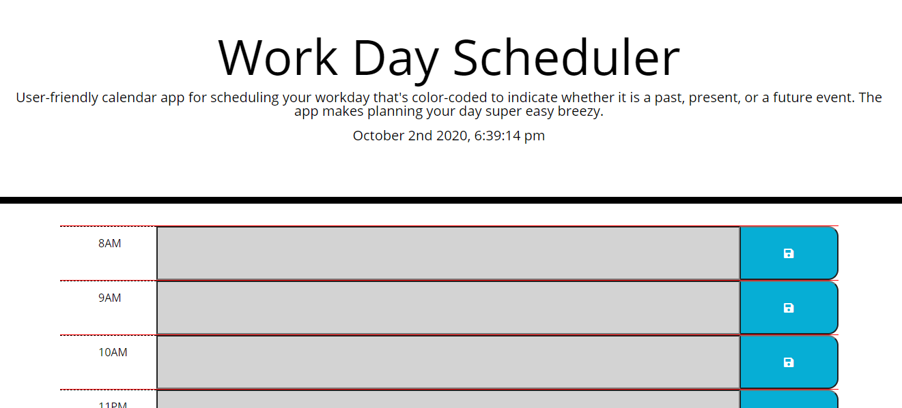

# WorkDayScheduler
A calendar application that allows a user to save events for each hour of the day to assist with managing time effectively.  

User-friendly calendar app for scheduling your workday that's color-coded to indicate whether it is a past, present, or a future event. The app makes planning your day super easy breezy.

https://mstuart90.github.io/WorkDayScheduler/

